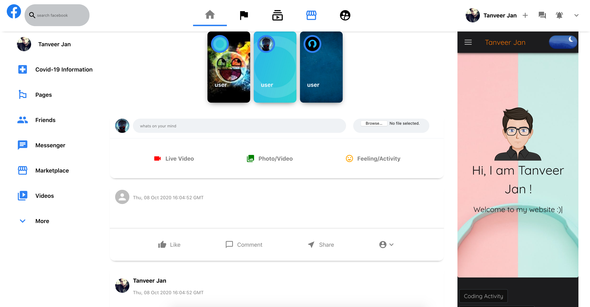

## Facebook Clone 

### Stack
 - ReactJS
 - NodeJS
 - MongoDB
 - ExpressJS

### Usage
The fb-backend folder should be in same location as the front-end.

#### Configurations
 - Firebase configurations should be inserted into the `firebase.js` file.
 - MongoDB Password should be inserted into `server.js` file in back-end folder.

#### Front-end
`
cd fb-clone
`
`
npm start
`

#### Back-end
`
nodemon server.js
`
